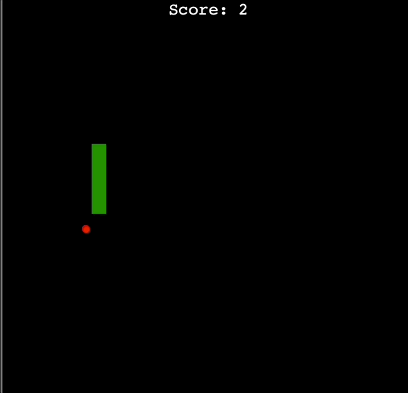

<h1>Day 21 - Build the Snake Game Part 2: Inheritance & List Slicing</h1>
<h2>Project: Snake Game (Part 2)</h2>
<ul>
    <li>Detect collision with food</li>
    <li>Create a scoreboard</li>
    <li>Detect collision with wall</li>
    <li>Detect collision with tail</li>
</ul>
